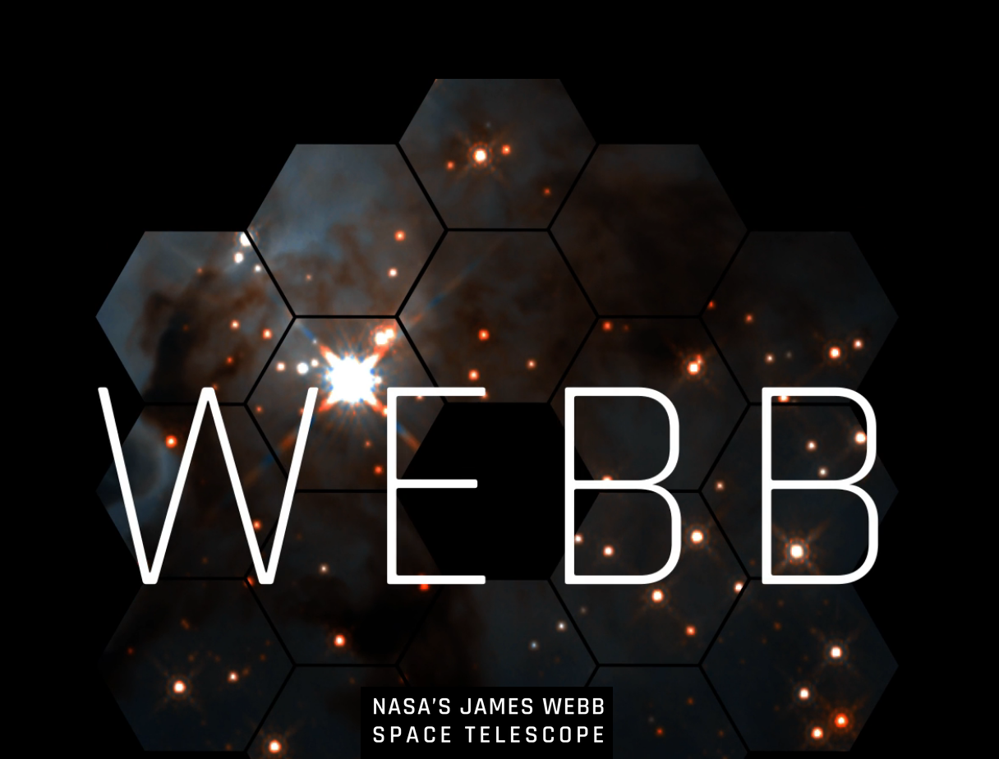
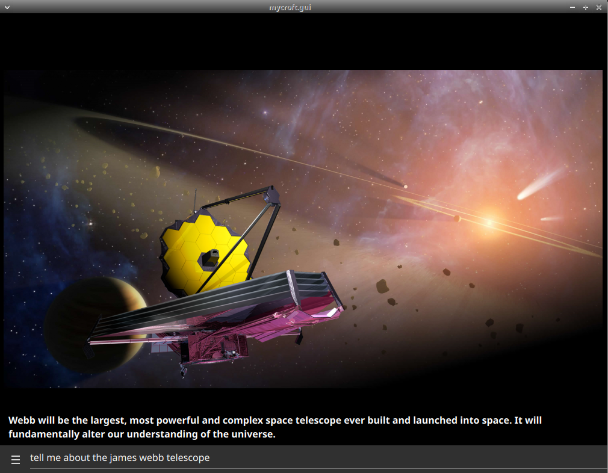

#  James Webb Space Telescope

## About

Pictures from [James Webb Space Telescope](https://webbtelescope.org/)
  
Can be used as idle screen for the mark2

## Examples
* "picture from james webb telescope"
* "explain"
* "tell me about the james webb telescope"

## TODO

- [quick facts](https://webbtelescope.org/quick-facts) intents not yet implemented

## Credits
- JarbasAi
- [Webb Space Telescope](https://www.jwst.nasa.gov/)

## Category
**Entertainment**

## Tags
#space
#nasa
